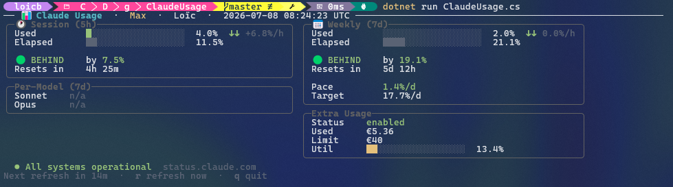

# Claude Usage Monitor

A terminal dashboard for your **Claude** subscription usage. It reads the OAuth
token that `claude login` already stored on your machine, polls Anthropic's usage
endpoint, and paints a live TUI with your session/weekly windows, per-model
breakdown, extra-usage spend, burn-rate pace, and current Claude service status.

```sh
dotnet run ClaudeUsage.cs
```

That's it — no build step, no `.csproj`. This is a **.NET file-based app**: the
single `ClaudeUsage.cs` declares its own dependencies via `#:package` directives
and runs directly.



## Requirements

- **.NET SDK 10.0** or newer (file-based apps require .NET 10). Check with `dotnet --version`.
- An authenticated Claude CLI session — credentials are read from
  `~/.claude/.credentials.json`. If you don't have them, run `claude login` first.

Dependencies (`Spectre.Console`) are restored automatically on first run.

## Usage

```sh
dotnet run ClaudeUsage.cs                 # live dashboard, refreshes every 15 min
dotnet run ClaudeUsage.cs -- --once       # print one report and exit
dotnet run ClaudeUsage.cs -- --interval 5 # refresh every 5 minutes
dotnet run ClaudeUsage.cs -- --dump       # probe raw usage endpoints (debug)
dotnet run ClaudeUsage.cs -- --help
```

> The `--` separates `dotnet run` arguments from the app's own arguments.

### Flags

| Flag | Alias | Description |
| --- | --- | --- |
| `--once` | `-1` | Print the report once and exit (good for scripts/cron). |
| `--interval <minutes>` | | Live refresh interval. Default `15`. |
| `--dump` | | Probe candidate OAuth endpoints and dump raw JSON. |
| `--help` | `-h` | Show help. |

> ⚠️ **`--dump` prints raw account data** — your org UUID, plan, display name, and
> full usage JSON. Redact it before pasting into a bug report or sharing publicly.

### Live-mode keys

- `r` — refresh now
- `q` — quit

## How it authenticates (unofficial)

> [!IMPORTANT]
> This tool uses an **undocumented, unofficial** endpoint. There is no public
> Anthropic API for subscription (Pro/Max) usage. It works by reusing the OAuth
> token the Claude CLI already stores, then calling the same internal endpoint the
> CLI itself uses:
>
> - Reads the access token from `~/.claude/.credentials.json`
>   (the `claudeAiOauth.accessToken` field written by `claude login`).
> - Sends it as `Authorization: Bearer <token>` with the
>   `anthropic-beta: oauth-2025-04-20` header to
>   `https://api.anthropic.com/api/oauth/usage`.
>
> Because it's internal, **Anthropic can change or remove it at any time** and this
> tool may break without notice. It's fine for a personal dashboard; don't build
> anything load-bearing on it. The token is read straight from your local Claude
> CLI credentials — this project never stores, logs, or transmits it anywhere
> except as the `Authorization` header to Anthropic's own API.

## How it works

- **Auth** — reuses the OAuth access token from `~/.claude/.credentials.json`; the
  token is re-read from disk as the Claude CLI rotates it, so long-running
  sessions keep working without a restart.
- **Rendering** — a background fetcher owns the network and publishes immutable
  view-models; the render loop only paints. The clock, countdown, and keypresses
  stay responsive even during an in-flight request or its timeout.
- **Resilience** — the last successful response is cached, so panels paint
  instantly on startup and survive transient network/API failures with backoff.
- **Trends** — a small local history is kept to show short-term deltas and
  burn-rate pace against your window limits.

### Local state

Cache and history are stored outside the repo, under your user profile:

- `%LOCALAPPDATA%\ClaudeUsage\cache.json`
- `%LOCALAPPDATA%\ClaudeUsage\history.json`

## Privacy

This tool talks only to `api.anthropic.com` (usage/profile) and
`status.claude.com` (service status). It does not transmit your token or usage
data to any third party. Your credentials never leave your machine except as the
`Authorization` header to Anthropic's own API.

## Disclaimer

Not affiliated with, endorsed by, or supported by Anthropic. "Claude" is a
trademark of Anthropic. Use at your own risk.

## License

Released into the public domain under [The Unlicense](LICENSE) — do whatever you
want with it.
